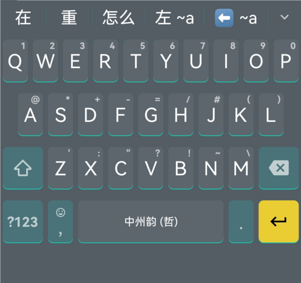
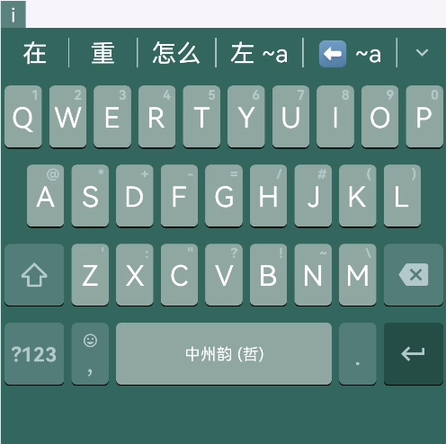

# 小企鹅输入法安卓版主题 Fcitx5-Andoird theme

看到主题设计的网站在那里，于是手痒移植了几款主题到手机上。  
小企鹅主题设计网址： https://fcitx5-android.github.io/theme-designer/  
当然不是原创了，都是随手找来的主题，如果**版权有争议，烦请告知，必删除**。

**说明：**
1. 我选择主题喜欢带边框，虽然也尽量考虑到了不带边框的效果，但仍以带框效果优先。  
2. 由于主题设计网站本身的功能缺失，长按键盘的弹出颜色可能没有调对，不过已经都检查过一遍，不会影响正常使用。
3. 有些内容如字体、每个键位单独的颜色等，不是不想做，是目前还不支持。
4. 如果主题设计网站功能有更新或者有其它的主题制作方法，欢迎告知。

## 使用方式：
1. 将主题压缩包下载至手机——直接下载 zip 包即可，截图和 json 文件仅供预览和修改用，实际上 zip 包里面就是同名 json 文件。
1. 手机键盘弹出→工具栏展开→三个省略号→主题，或者小企鹅APP→主题
2. 选择新增主题→导入文件，选择主题压缩包。

如无意外，应该直接导入成功。

回到主题界面，在列表中缩略图上有笔形图案的为导入的主题，直接点击选择就可以使用了。

预览图：
### 1. 同文风·tongwenfeng

### 2. 暗绿·DarkGreen

### 3. 绿色·GreenSkin

### 4. 搜狗·sogou_skin1

### 5. 搜狗·sogou_skin2

### 6. 搜狗·sogou_skin3

