# 小企鹅输入法安卓版主题 Fcitx5-Andoird theme

看到主题设计的网站在那里，于是手痒移植了几款主题到手机上。

小企鹅主题设计网址： https://fcitx5-android.github.io/theme-designer/

自己总结了一个网页版主题设计工具的参数说明文档 Fcitx5Android_theme-disigner_manual.md，欢迎使用。
[Fcitx5Android_theme-disigner_manual.md](./Fcitx5Android_theme-disigner_manual.md)
 

当然不是原创了，都是随手找来的主题，如果**版权有争议，烦请告知，必删除**。

[TOC]

**说明：**
1. 我选择主题喜欢带边框，虽然也尽量考虑到了不带边框的效果，但仍以带框效果优先。
2. 由于主题设计网站本身的功能缺失，长按键盘的弹出颜色可能没有调对，不过已经都检查过一遍，不会影响正常使用。
3. 有些内容如字体、每个键位单独的颜色等，不是不想做，是目前还不支持。
4. 如果主题设计网站功能有更新或者有其它的主题制作方法，欢迎告知。

## 使用方式：
1. 将主题压缩包下载至手机——直接下载 themes 目录中的 zip 包即可，截图和 json 文件仅供预览和修改用，实际上 zip 包里面就是同名 json 文件。
1. 手机键盘弹出→工具栏展开→三个省略号→主题，或者小企鹅 APP→主题
2. 选择新增主题→导入文件，选择主题压缩包。

如无意外，应该直接导入成功。

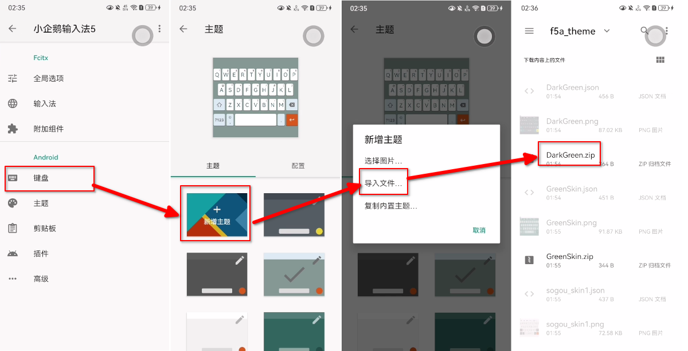

回到主题界面，在列表中缩略图上有笔形图案的为导入的主题，直接点击选择就可以使用了。

预览图：
### 1. 同文风·tongwenfeng

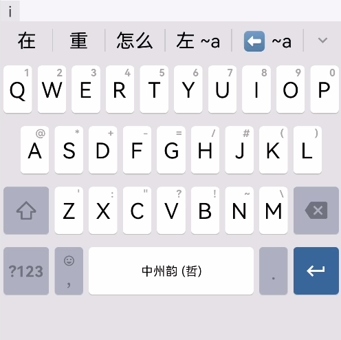

### 2. 暗绿·DarkGreen

### 3. 绿色·GreenSkin

### 4. 搜狗·sogou_skin1

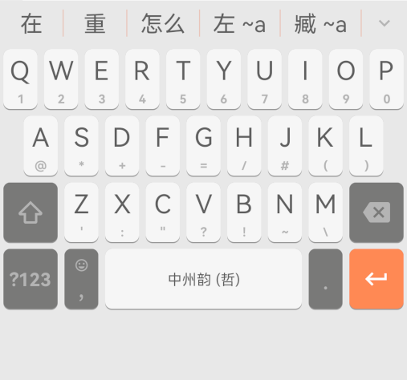

### 5. 搜狗·sogou_skin2

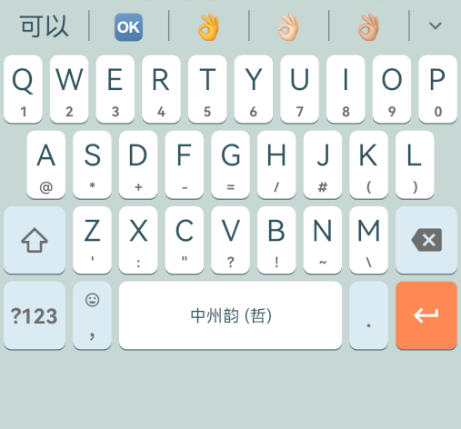

### 6. 搜狗·sogou_skin3

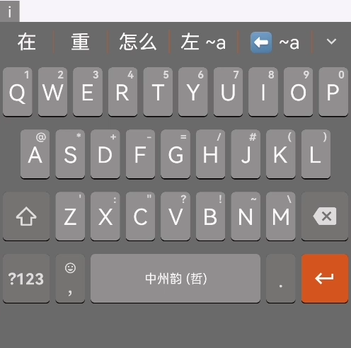

### 7. 红黄蓝

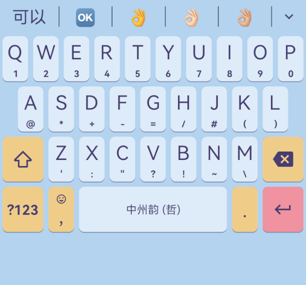

### 8. cyberpunk2024

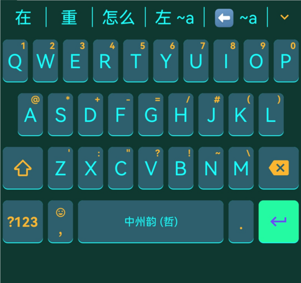

### 9. mintWhite

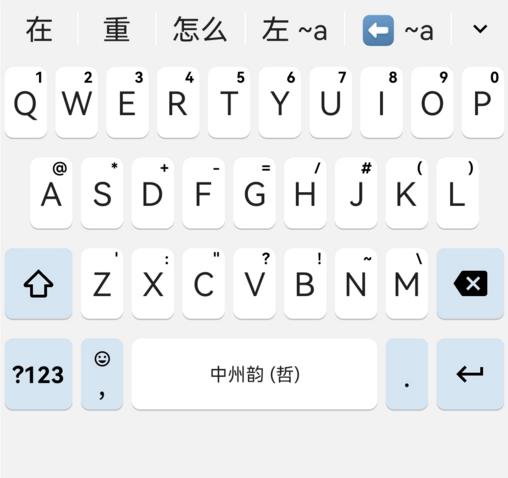

### 10. Calc 系列

#### Calc2

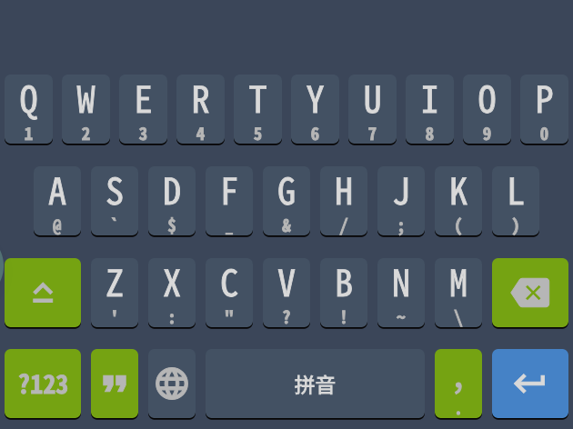

#### Calc3

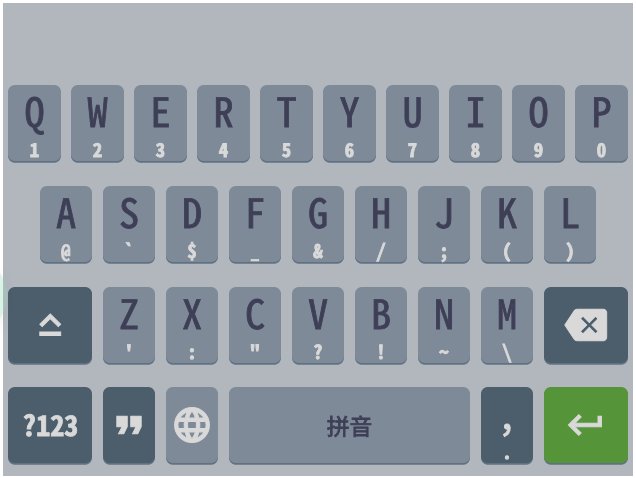

#### Calc4

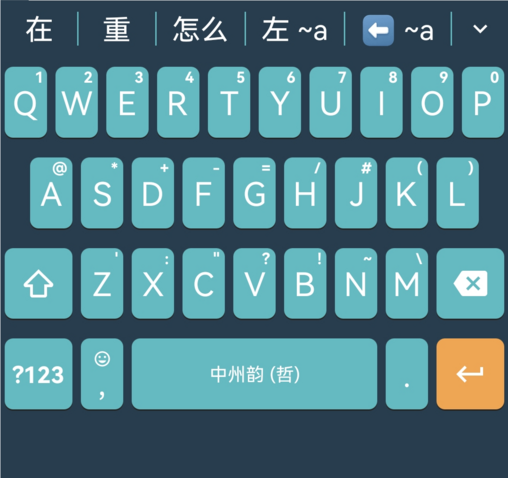

#### WinCalc
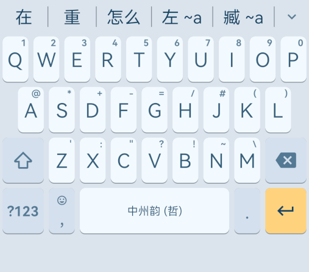

### 11. baiduDark

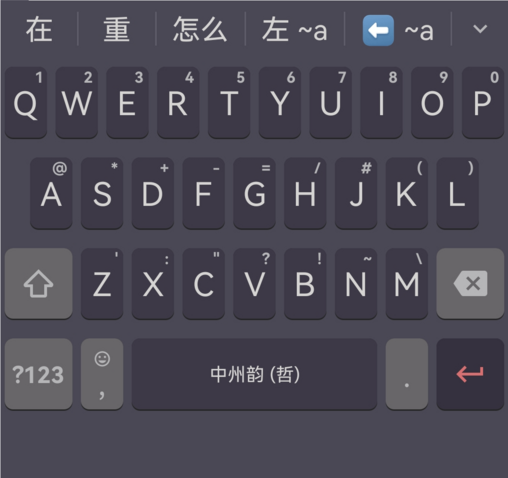

### 12. goinput

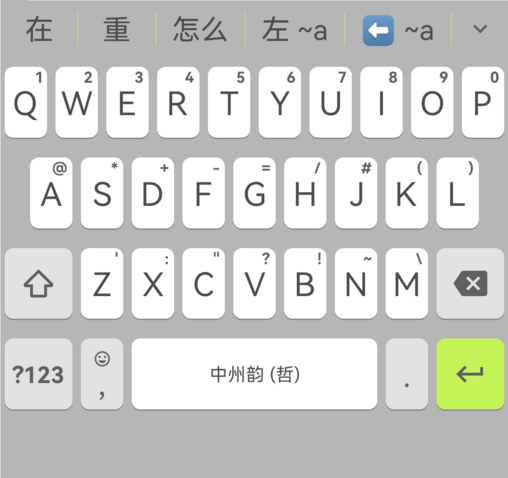

### 13. Greysilver

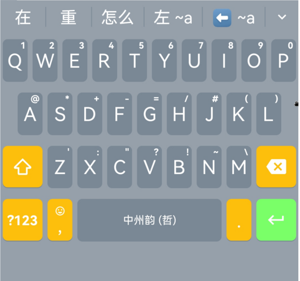

### 14. DarkSalmon

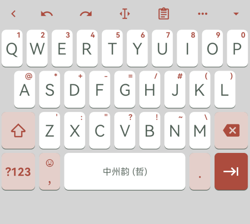

### 15. LightGreen

### 16. RoseRed

### 17. 翠竹·Bamboo
 **注意：** 此皮肤有透明背景，截图分别为`白底`、`深色`、`浅色`三种背景下的效果。  
 **已知：** 绝大多数 APP 中都有自动抬升输入框的功能，所以此皮肤会显示白底效果，在知乎评论区、QQ 搜索等部分页面会显示背景后文字。

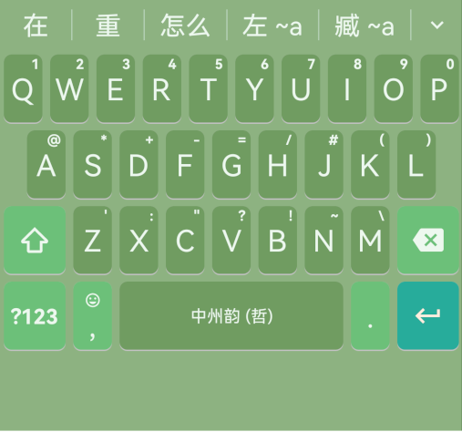

### 18. 酱紫·Purple
继续尝试透明皮肤。

### 19. 青黄木瓜·Papaya
继续尝试透明皮肤，这次透明度高一点。
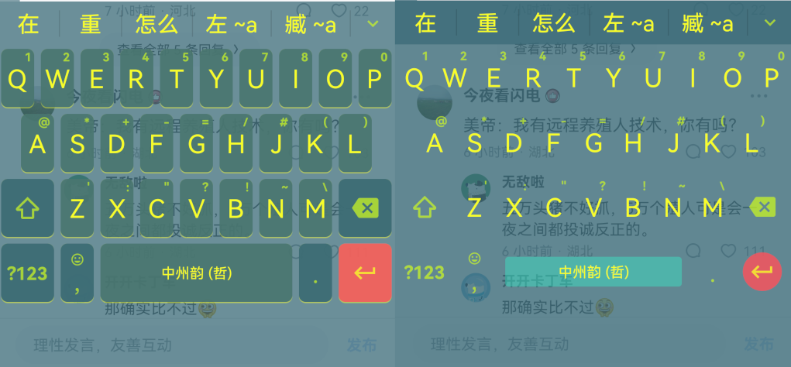

### 20. 仿自森林集·write
小企鹅能自定义的元素真不多，有些效果实在做不出来。
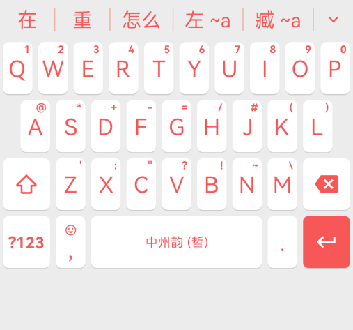

### 21. 是Gboard吖·isGboard
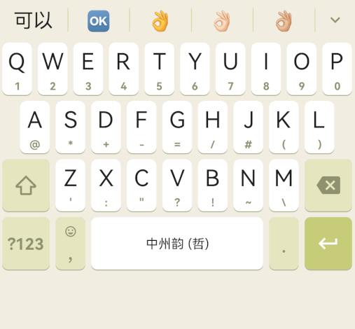

╌╌╌╌╌╌╌
2024-12-30：今天主题设计网站又更新了，可以调节候选词颜色了。
╌╌╌╌╌╌╌

### 22. trimeGreen
以前就做好的，居然没截图。
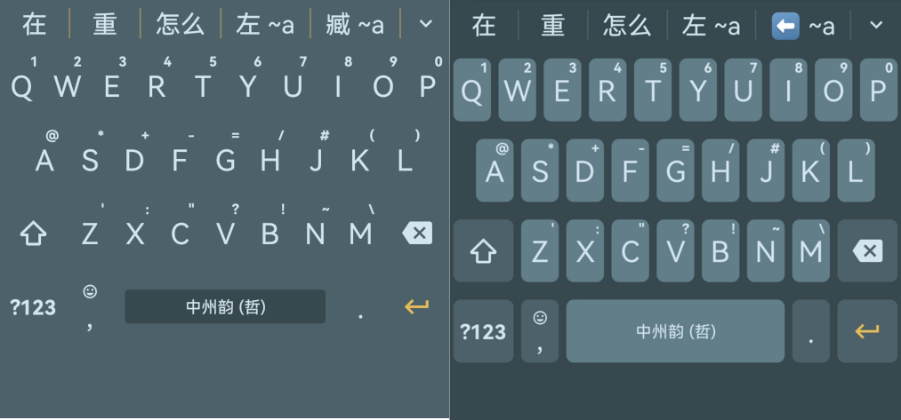

### 23. Brownish 棕色
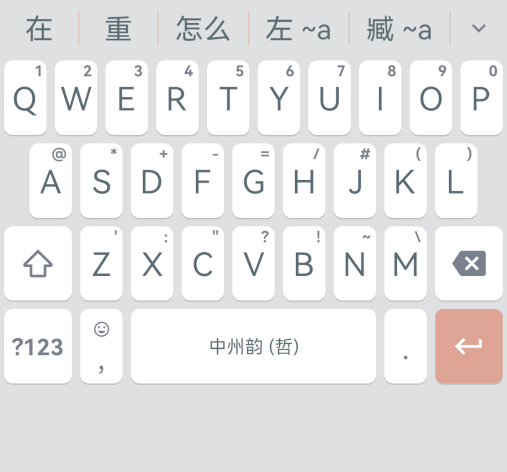

### 24. 仿iOS
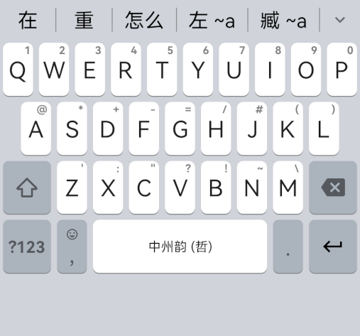

### 25. 赛博朋克·cyberpunk2025
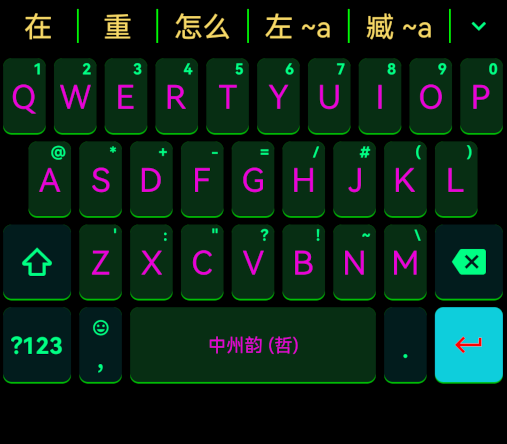
